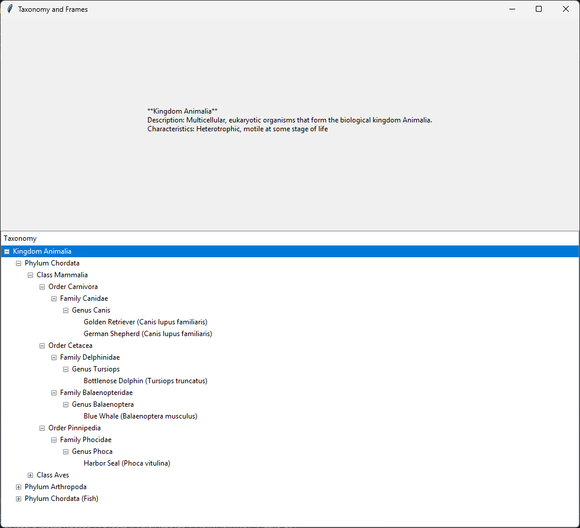
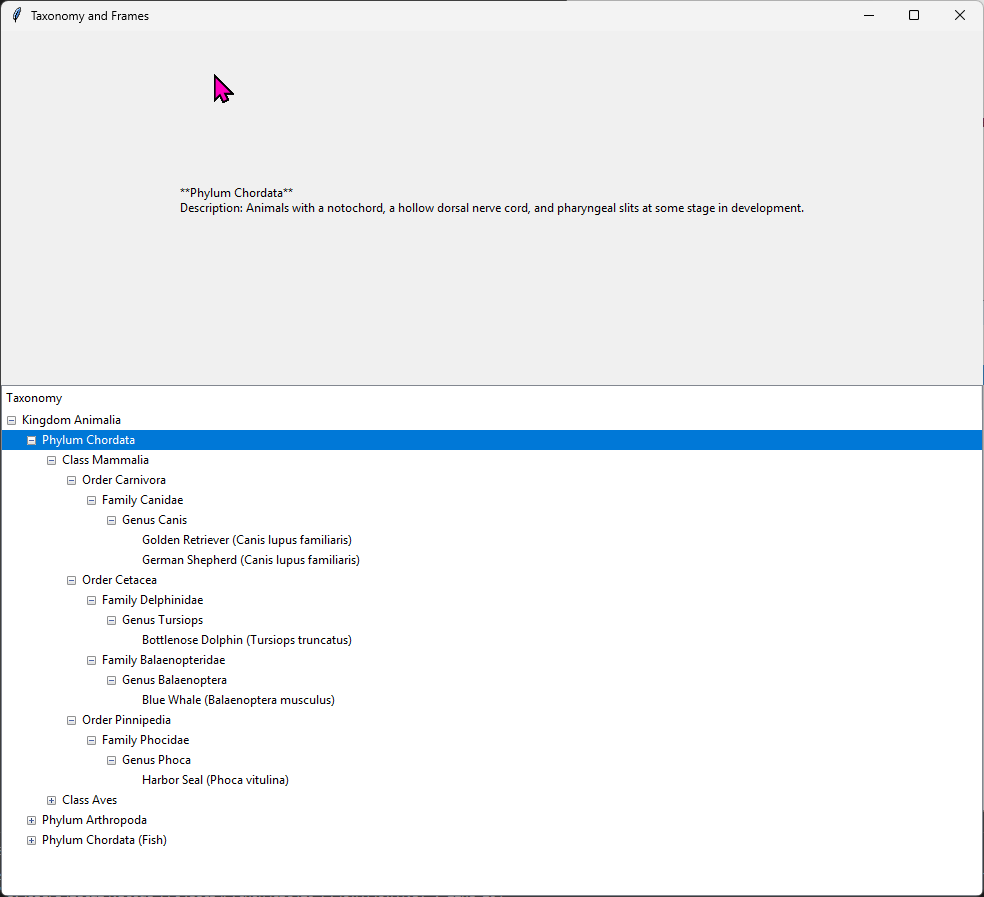
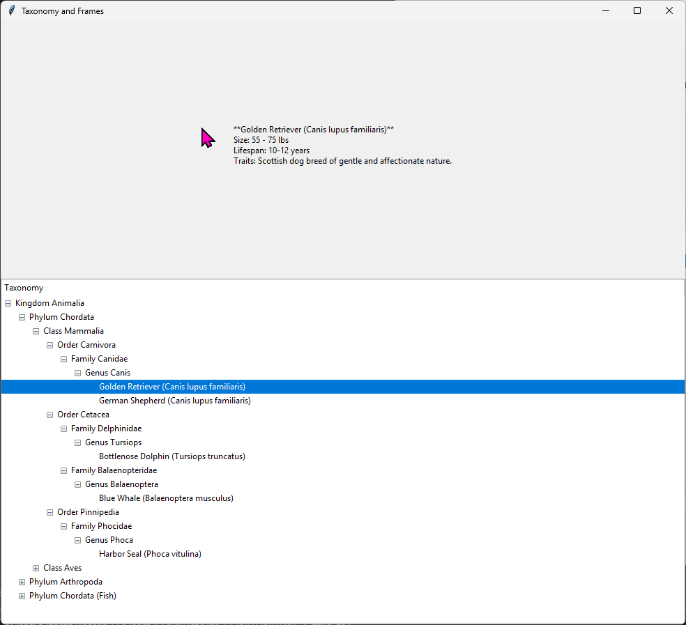

# **Taxonomy and Frames Viewer**

A Python-based GUI application that displays a hierarchical taxonomy of the animal kingdom. Users can navigate the taxonomy tree, view detailed information about species and subcategories, and learn about their attributes and relationships.

---

## **Features**
- **Interactive Taxonomy Tree:** Explore categories like Kingdom, Phylum, Class, and Species in a tree view
- **Detailed Frame Data:** Select any species or subcategory to view relevant attributes (e.g., size, lifespan, traits, WIP)
- **Customizable Taxonomy:** Easily extend the taxonomy to include additional domains or subcategories.

## **Examples of Application**

### Taxonomy Tree

- This application follows a Taxonomic structure.  Higher levels in the tree represent broader categories while lower levels are more and more specific.
- In the above image, The animalia level represents the Animal Kingdom.  These organisms are heterotrophic and multicellular.  All levels below animalia share these same traits with animalia.

- The phylum Chordata shares the two existing traits with animalia, being heterotrophic and multicellular.  However they have more specific traits that have to do with how they develop: a notochord and left-right symmetry.
- The further we go down the levels in the tree, the more specific the traits get, until we reach an organism

- A dog, or golden retriever in this case, has all the characteristics of every level above it including chordata and animalia.  